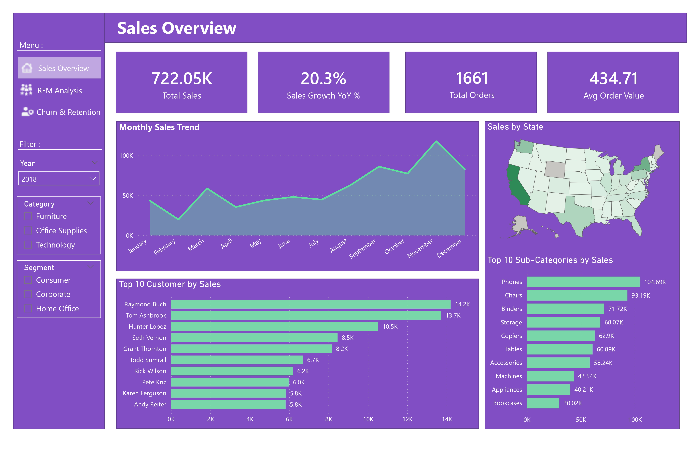
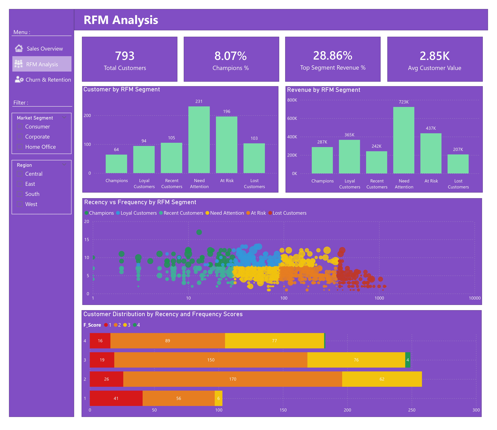
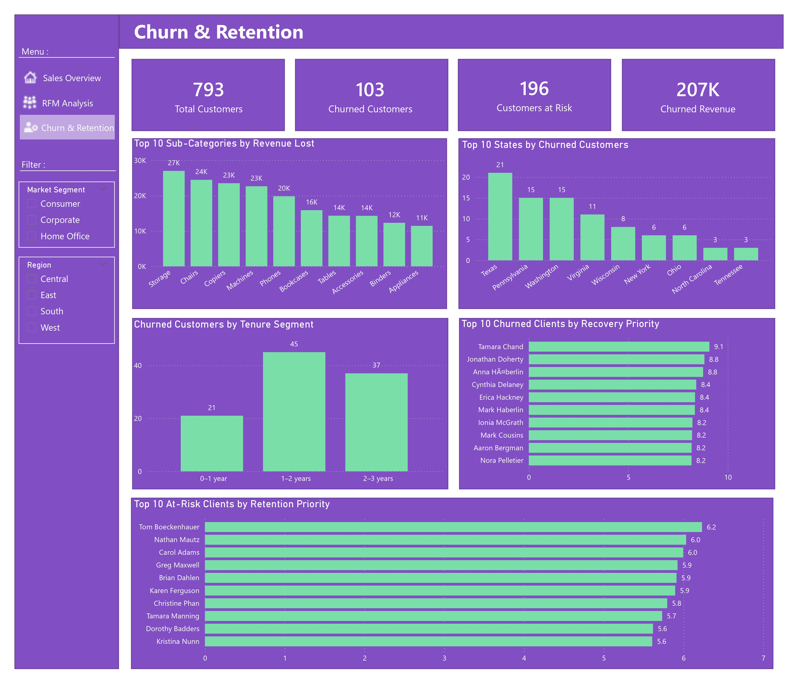

# Supermarket Sales & Customer Intelligence Analysis

## Project Overview

This project analyzes a multi-year supermarket sales dataset to uncover revenue drivers, customer behavior patterns, and churn risks.

The objective was to move beyond basic reporting and build a structured Business Intelligence solution that provides:

- Sales performance monitoring
- Customer segmentation using RFM analysis
- Churn detection and retention prioritization

The project combines SQL data modeling and Power BI dashboard development.

## Business Objectives

1. Identify key revenue drivers (products, regions, segments).
2. Segment customers using RFM methodology.
3. Detect churned and at-risk customers.
4. Quantify revenue lost due to churn.
5. Prioritize customer recovery actions.

## Project Workflow

1. Raw data exploration and quality assessment  
2. Data cleaning, normalization, and schema design in SQL Server  
3. Star schema implementation (Fact & Dimension tables)  
4. RFM score calculation and customer segmentation  
5. Analytical KPI layer creation (SQL Views & DAX measures)  
6. Customer churn identification and revenue impact analysis  
7. Interactive dashboard development in Power BI
   
## Tools & Technologies

- SQL Server (Data Modeling & Transformation)
- Power BI (Data Visualization & DAX)
- RFM Segmentation Methodology
- DAX for KPI calculations

## Data Cleaning & Preparation (SQL Server)

The dataset was transformed into a star schema model:

- `Fact_Sales`
- `Dim_Customer`
- `Dim_Product`
- `Dim_Date`

Key steps:
- Data cleaning and deduplication
- Primary and foreign key implementation
- Date dimension creation
- Revenue and profitability calculations
- RFM score computation

## SQL Script Structure

The SQL workflow was divided into two main scripts:

### 01_Data_Preparation_Modeling.sql
   - Data cleaning and deduplication
   - Standardization
   - Star schema creation (Fact & Dimension tables)
   - Primary and foreign key implementation

### 02_Analytics_Views_KPI.sql
   - Creation of analytical views
   - KPI calculations
   - RFM score computation
   - Customer churn classification
     
## Power BI Dashboard

### Sales Overview
- Total Sales
- Sales Growth (YoY %)
- Total Orders
- Average Order Value
- Monthly Sales Trend
- Sales by State
- Top Performing Sub-Categories

### RFM Analysis
- Customer distribution by RFM segment
- Revenue contribution by segment
- Recency vs Frequency behavioral visualization
- Segment-level revenue performance

### Churn & Retention Analysis
- Churned Customers
- Customers at Risk
- Revenue Lost due to Churn
- Churn by Tenure
- Recovery & Retention Priority Customers

## Key Insights

- A small percentage of customers generate a disproportionate share of revenue.
- Significant revenue is concentrated in specific sub-categories.
- Customers with high recency but declining frequency represent early churn signals.
- Revenue loss from churned customers highlights the importance of retention strategies.

## DAX Examples (Key Measures)

Below are examples of key DAX measures used to build KPIs and customer intelligence indicators.

### Total Sales
```DAX
Total Sales =
SUM(Fact_Sales[Sales])
```
### Total Orders
```DAX
Total Orders =
DISTINCTCOUNT(Fact_Sales[Order ID])
```
### Sales Last Year (LY)
```DAX
Sales LY =
VAR SelectedYear = SELECTEDVALUE(Dim_Date[YearNumber])
RETURN
IF(
    ISBLANK(SelectedYear),
    BLANK(),
    CALCULATE(
        [Total Sales],
        FILTER(
            ALL(Dim_Date),
            Dim_Date[YearNumber] = SelectedYear - 1
        )
    )
)
```
### Sales Growth YoY %
```DAX
Sales Growth YoY % = 
VAR CurrentSales = [Total Sales]
VAR LastYearSales = [Sales LY]
VAR Diff = CurrentSales - LastYearSales
RETURN
IF(
    ISBLANK(LastYearSales) || LastYearSales = 0,
    BLANK(),
    DIVIDE( Diff, LastYearSales )
)
```
### Churned Customers
```DAX
Churned Customers = 
CALCULATE(
    DISTINCTCOUNT('RFM Segment'[Customer ID]),
    'RFM Segment'[Churn Status]="Churned"
)
```
### Champions Customers %
```DAX
Champions % = 
DIVIDE(
    CALCULATE(
        COUNT('RFM Segment'[Customer ID]),
        'RFM Segment'[RFM_Segment] = "Champions"
    ),
    [Total Customers]
)
```
### Customers at Risk
```DAX
Customers at Risk = 
CALCULATE(
    DISTINCTCOUNT('RFM Segment'[Customer ID]),
    'RFM Segment'[RFM_Segment]="At Risk"
)
```

## Dashboard Preview

### Sales Overview


### RFM Analysis


### Churn & Retention


## Power BI File

The Power BI file (.pbix) is available upon request.

## Skills Demonstrated

- Data modeling using Star Schema (Fact & Dimension tables)
- SQL data transformation and normalization
- RFM customer segmentation methodology
- Customer churn analysis
- Revenue impact analysis
- Advanced DAX calculations (CALCULATE, FILTER, ALL, VAR)
- Customer retention prioritization strategy
- End-to-end BI workflow (SQL → Data Model → Power BI)

## Author

Mohamed Fakhri Ben Brahim  
Aspiring Data Analyst | Python | SQL | Power BI | DAX | Advanced Excel
